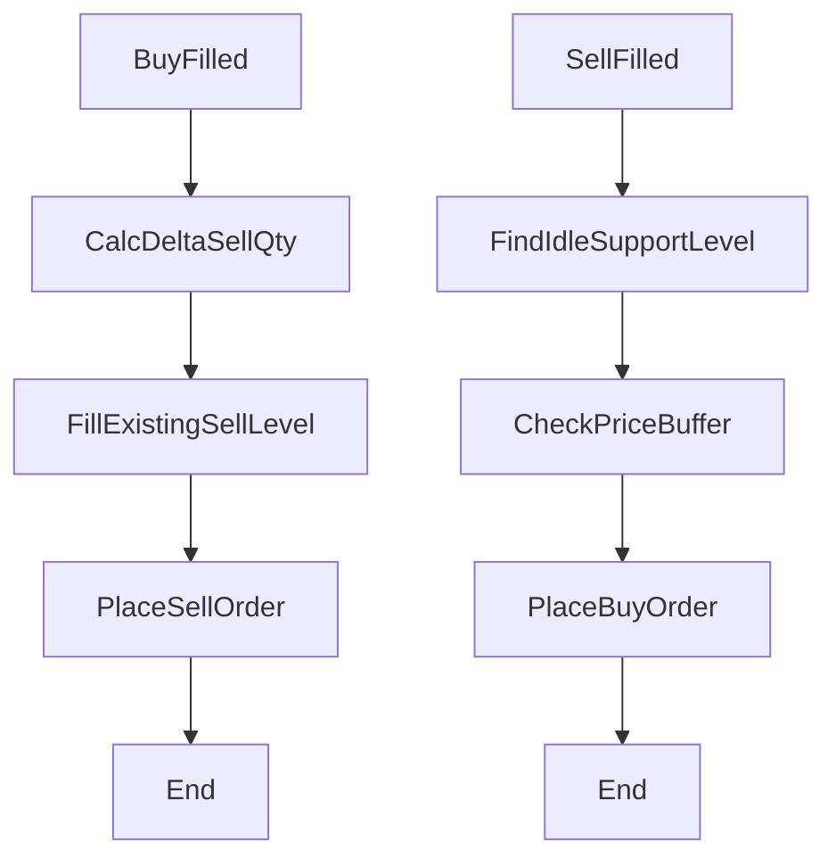
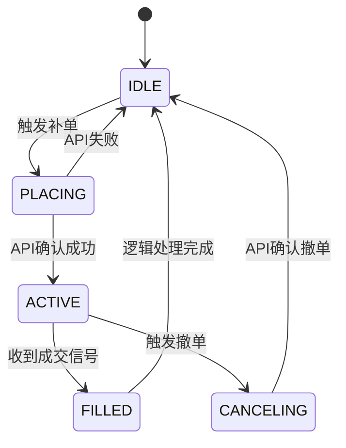

# Key Level Grid 需求规格说明书 (V3.0 - 终极整合版)

## 1. 系统架构：双轨异步驱动机制

系统基于 `asyncio.Lock` 维护核心状态 `GridMap`，通过两套并行逻辑确保响应速度与最终一致性。

### 1.1 事件驱动轨道 (Event Track) - 微观反射

- **触发源**：WebSocket 订单成交事件 (`FILLED`)。
- **核心逻辑**：
  - **买成交反射**：立即重算均价，按 `sell_quota_ratio` 在上方最近有效阻力位执行“增量补卖”。
  - **卖成交反射**：释放对应支撑位的 `fill_counter` 配额，并清理该阻力位状态。
- **特点**：低延迟、单点处理、不扫描全局。

### 1.2 全局对账轨道 (Recon Track) - 宏观守卫

- **执行周期**：`recon_interval_sec` (默认 60s)。
- **核心逻辑**：
  - **极性与空间对账**：根据现价划分水位角色，并校验买/卖缓冲区。
  - **瀑布流重排**：基于“利润避让”原则，确保 70% 止盈单在满足利润的水位上物理对齐。
  - **自愈机制**：修复漏单、多单、及因均价漂移导致的无效止盈单。

---

## 2. 核心逻辑算法 (Algorithms)

### 2.1 物理极性判定与空间守卫

水位角色随现价实时变化，但挂单受缓冲区保护：

- **支撑位 (Support)**：`Level_Price < Current_Price`。
- **买单挂出条件**：角色为 Support，且 `Current_Price > Level_Price * (1 + buy_price_buffer_pct)`。

- **阻力位 (Resistance)**：`Level_Price > Current_Price`。
- **卖单挂出条件**：角色为 Resistance，且
  - 空间校验：`Current_Price < Level_Price * (1 - sell_price_buffer_pct)`，
  - 利润校验：`Level_Price > Avg_Entry_Price * (1 + min_profit_pct)`。

### 2.2 水位配额计数器 (Quota Counter)

- **限额逻辑**：每个水位拥有 `fill_counter`。买单成交则 `fill_counter += 1`。
- **回补逻辑**：当 `fill_counter >= max_fill_per_level`（默认 1）时，禁止在该水位补买单。
- **释放逻辑**：仅当该水位产生的筹码在阻力位被卖出后，计数器重置为 `0`。

### 2.3 利润避让瀑布流 (Profit-Guard Waterfall)

在分配 `Total_Sell_Qty` 时，执行以下流程：

1. **利润过滤**：跳过所有 `Level_Price <= Avg_Entry_Price * (1 + min_profit_pct)` 的水位。
2. **物理分配**：从最近的合格阻力位开始，按 `base_amount_per_grid` 阶梯填充。
3. **增量改单**：若目标数量与实盘数量不符，执行“物理合并改单”（撤旧挂新或 Amend）。

---

## 3. 详细动作分解 (Execution Details)

### 3.1 增量改单 (Incremental Adjustment)

- **定义**：当水位已存在活跃订单时，不创建新订单，而是修改原单。
- **公式**：`delta_qty = target_qty - open_qty`。
- **执行**：
  - 若 `delta_qty > 0`：执行增量补单；
  - 若 `delta_qty < 0`：执行减量改单（不支持 Amend 则撤旧挂新）。

### 3.2 极性翻转处理 (Polarity Flip)

- **防冲突撤单**：当水位从 Support 变为 Resistance 时，Recon 必须先撤销所有买单。
- **角色重置**：清理 `fill_counter` 状态（视策略可选），重新根据瀑布流算法评估是否挂卖单。

---

## 4. 状态机与冲突防御 (FR-STATE)

| 状态 | 说明 | 轨道冲突规则 |
| --- | --- | --- |
| **IDLE** | 无任务 | 两轨均可发起 `PLACING` |
| **PLACING** | API 调用中 | 互斥锁锁定。另一轨道必须跳过此水位 |
| **ACTIVE** | 已挂单 | Event 等待成交；Recon 负责增量对齐或撤单 |
| **FILLED** | 待处理 | Event 独占处理补单反射，完成后转 `IDLE` |
| **CANCELING** | 撤单中 | 互斥锁锁定。禁止其他一切操作 |

---

## 5. 风控与异常处理 (FR-RISK)

1. **止损全覆盖**：Recon 每周期更新 `reduce_only` 止损单，数量覆盖 `Current_Holdings`。
2. **API 容错**：若 Event 补单失败，不进行重试，标记水位为 `IDLE`，由 Recon 在下一分钟自动修复。
3. **资金保护**：若 `Total_Sell_Qty` 计算结果异常，或所有阻力位均不满足利润避让，系统应停止挂出任何卖单。

---

## 6. AI 开发指令 (Developer Directives)

1. **原子化操作**：所有 API 写入（下单/撤单）必须封装在 Level-Level Lock 异步锁中。
2. **幂等性设计**：Recon 每次同步前必须重新从交易所拉取 Open Orders 镜像，严禁依赖内存状态做减法。
3. **数据口径**：内部逻辑使用“币数量”，物理执行前转换为“张数”。最小单位不足一格时向下合并。
4. **持久化要求**：`fill_counter`、`Avg_Price` 必须实时落地 JSON，确保重启后“配额锁定”依然有效。

---

## 7. 验收场景建议

- **震荡市测试**：验证在买单成交且对应卖单未成交前，同一水位是否保持 `IDLE` 且不挂单。
- **利润规避测试**：手动拉高 `min_profit_pct`，验证 Recon 是否自动撤销过于接近均价的低位卖单。
- **暴力极性测试**：手动向交易所下入大额头寸，验证 Recon 是否在上方阻力位按瀑布流铺开卖单。

---

# 补充需求：网格重置与冷启动对齐逻辑 (FR-RESET)

## 1. 重置场景定义

系统必须能够处理以下三种重置场景：

1. **冷启动恢复 (Cold Start)**：程序崩溃或手动重启。
2. **清仓重置 (Zero-Position Reset)**：由于止损或手动清仓导致持仓归零。
3. **手动强制重置 (Manual Override)**：用户通过 Telegram 指令强制清空计数器。

## 2. 核心处理逻辑

### 2.1 冷启动：实盘反向推导 (Reverse Reconciliation)

**场景**：启动时 `state.json` 损坏或与实盘不一致。

- **原则**：以交易所持仓为准，反向锁定水位。
- **逻辑流程**：
  1. 获取当前账户 `Total_Holdings`（总持仓）。
  2. 计算需要锁定的配额总数：`Total_Holdings / base_amount_per_grid`（向下取整）。
  3. **分配锁定**：从当前价格向下的支撑位中，按**从远到近**（或按成交记录）的顺序，将对应水位的 `fill_counter` 设为 1，直到达到锁定总数。
  4. **意义**：确保即使重启，系统也知道哪些水位已经贡献了持仓，从而防止在这些水位重复买入。

### 2.2 自动归零逻辑 (Auto-Clear)

- **触发点**：在 `Recon` 周期中，若检测到 `Total_Holdings == 0`。
- **动作**：立即将所有网格水位的 `fill_counter` 统一清零。
- **状态迁移**：所有水位从锁定状态恢复为 `IDLE`，重新获得买入权利。

### 2.3 局部释放逻辑 (Incremental Reset)

- **触发点**：`Event Track` 捕获到止盈单成交。
- **动作**：根据成交的币数量，计算释放的配额数（`filled_qty / base_amount_per_grid`）。
- **优先级**：优先释放价格最低（最远端）的支撑位 `fill_counter`。

## 3. 状态一致性守卫 (Consistency Guard)

为了防止逻辑漏洞，AI 必须在重构时实现以下守卫：

- **配额溢出守卫**：任何时候，`sum(fill_counter) * base_amount_per_grid` 必须等于（或通过比例接近）实盘持仓量。若差异超过 1 个网格单位，Recon 必须发出告警并强制进行反向推导。
- **锁保护**：重置动作（尤其是 `fill_counter = 0`）必须持有全局 `GridLock`，防止在重置瞬间 Event 轨道尝试写入成交数据。

## 4. 给 AI 的重构指令 (Reset Module)

> **请实现以下重置守卫逻辑：**
> 1. **编写 `reconcile_counters_with_position()` 函数**：系统启动或 Recon 发现持仓偏差时调用。该函数需根据当前 Position 数量，从低位向高位依次“认领” `fill_counter`，确保本地计数与实盘持仓对齐。
> 2. **增强 `on_sell_filled` 回调**：在处理卖单成交时，除了更新持仓，必须精准定位并递减对应支撑位的 `fill_counter`。
> 3. **持久化安全性**：在执行任何 `reset` 操作后，必须立即触发 `state.save()`，防止因二次崩溃导致状态丢失。

## 5. 架构师总结

该需求解决了网格系统的“记忆丢失”问题。无论是手动平仓还是断线重启，系统在下一次 Recon 时都能基于持仓反向找回网格进度。
这份需求规格说明书整合了所有深度讨论的逻辑，聚焦**双轨解耦架构**、**70% 动态止盈**、**均价利润保护**、**空间缓冲区**与**水位状态机**。建议作为 V2.7.2 主规范使用。

---

# 需求规格说明书：Key Level Grid 智能网格系统 (V2.7.2 - 利润避让版)

## 1. 项目概述

本系统是一个基于支撑/阻力位的自适应网格策略，旨在通过“静态坐标系”捕捉波动，并利用“动态头寸管理”保护利润。

- **核心逻辑**：30% 浮动底仓锁定 + 70% 动态阶梯止盈。
- **执行架构**：全局对账守卫 (Recon) + 事件驱动响应 (Event) 的双轨制。

---

## 2. 核心参数配置 (Settings)

| 参数名 | 默认值 | 意义说明 |
| --- | --- | --- |
| `sell_quota_ratio` | 0.7 | **动态止盈比例**：保留 30% 为底仓，卖出总持仓的 70%。 |
| `min_profit_pct` | 0.005 | **利润护城河**：卖价必须高于持仓均价 0.5%，否则不挂单。 |
| `buy_price_buffer_pct` | 0.002 | **买单空间缓冲**：现价与支撑位拉开 0.2% 才允许挂买单。 |
| `sell_price_buffer_pct` | 0.002 | **卖单空间缓冲**：现价与阻力位拉开 0.2% 才允许挂卖单。 |
| `base_amount_per_grid` | 0.01 | **标准网格单位**：每个支撑位固定买入数量（币数量，见 FR-UNIT）。 |
| `base_position_locked` | 0 | **底仓锁定**：固定底仓数量（币数量）。 |
| `direction` | LONG | **交易方向**：仅支持只做多（LONG）。 |
| `recon_interval_sec` | 30 | Recon 对账周期（可动态调节）。 |
| `order_action_timeout_sec` | 10 | 挂/撤单超时，超时触发状态回收。 |

---

## 3. 动态极性与空间守卫 (FR-POLARITY)

### 3.1 物理极性定义

- **支撑位 (Support)**：当 `Level_Price < Current_Price`。
- **阻力位 (Resistance)**：当 `Level_Price > Current_Price`。
- **等价**：当 `Level_Price == Current_Price` 时不挂单，等待价格拉开。

### 3.2 补单守卫逻辑 (Safety Guard)

引入买/卖不同的空间缓冲区，强制要求价格“站稳”后才允许挂单。

- **买单挂出前提**：
  1. 角色为 `Support`。
  2. 空间校验：`Current_Price > Level_Price * (1 + buy_price_buffer_pct)`。

- **卖单挂出前提**：
  1. 角色为 `Resistance`。
  2. 空间校验：`Current_Price < Level_Price * (1 - sell_price_buffer_pct)`。
  3. **利润守卫**：`Level_Price > Avg_Entry_Price * (1 + min_profit_pct)`。

---

## 4. 核心分配算法 (FR-ALG)

### 4.1 理论应挂总量公式 (Total Sell Target)

系统在对账（Recon）和成交（Event）时，必须以此公式作为基准锚点：

$$Total\_Sell\_Qty = max(Current\_Holdings - Base\_Position\_Locked, 0) \times sell\_quota\_ratio$$

注：若系统未设置固定底仓（Base_Position_Locked = 0），则直接按总持仓比例计算。

### 4.2 阶梯卖单分配算法 (Waterfall Allocation)

系统采用“利润避让瀑布流”分配卖单。设 $Q_{rem}$ 为待分配的总额度，从现价上方最近阻力位 $P_{r1}$ 开始迭代。

算法逻辑：

1. 初始化：$Q_{rem} = Total\_Sell\_Qty$
2. 候选筛选：仅保留满足 `Level_Price > Avg_Entry_Price * (1 + min_profit_pct)` 的阻力位。
3. 逐层分配（从近到远）：
   - **IF** 不满足利润守卫：标记为 `PROFIT_LOCKED`，跳过该水位。
   - **ELSE** 分配 $q_n = \min(Q_{rem}, base\_amount\_per\_grid)$，更新 $Q_{rem} = Q_{rem} - q_n$。
4. 尾差处理：若迭代结束 $Q_{rem}$ 仍有剩余，累加到最后一个满足利润守卫的阻力位。
5. 最小订单校验：若任意 $q_n < Exchange\_Min\_Qty$，则该订单向下合并到 $q_{n-1}$，并做总量校正。
6. 数量口径：上述数量均为**币数量**（如 BTC），若交易所要求张数则换算为张数后下单。

---

## 5. 数量口径与计价展示 (FR-UNIT)

### 5.1 统一口径
- 系统内部主口径为**币数量**（如 BTC）。
- 若交易所使用张数下单，需按 contractSize 换算为张数后再提交。
- 外部展示（日志/Telegram）必须实时按 Ticker 价格换算为 **USDT 计价**。

### 5.2 换算规则
- 合约张数 = 币数量 / contractSize（向上取整并满足最小下单量）
- 币数量 = 合约张数 × contractSize  
- USDT 价值 = 币数量 × 价格

---

## 6. 双轨制运行机制 (FR-LOOP)

### 6.1 轨道 A：全局对账守卫 (Recon Track)

周期性执行（30s-60s），确保最终一致性：

1. **角色判定**：
   - `Level_Price < Current_Price` 为 Support；`Level_Price > Current_Price` 为 Resistance；相等时不挂单。

2. **买单同步**：
   - 仅对 Support 水位生效。
   - 若水位状态为 `IDLE` 且满足 `Current_Price > Level_Price * (1 + buy_price_buffer_pct)`，补挂买单。

3. **卖单比例纠偏**：
   - 计算“已挂卖单总量”与“理论应挂总量 (Total_Sell_Qty)”的差值。
   - 若差值 > 1 个标准网格单位，按阻力位由近及远执行增量补单或减量撤单。

4. **利润避让重排**：
   - 仅对 Resistance 水位生效。
   - 若卖价低于 `Avg_Entry_Price * (1 + min_profit_pct)`，执行撤单并在更高阻力位重排。
   - 若所有阻力位均不满足利润守卫，卖单全部保持 IDLE，并发送预警。

### 6.2 轨道 B：事件驱动响应 (Event Track)

WebSocket 实时触发，追求极速响应：

1. **买单成交 (On Buy Filled)**：
   - 更新内存中的持仓数量与**均价**。
   - 计算本次成交增量的卖出额度：  
     $\Delta Q_{sell\_inc} = \Delta Q_{buy} \times sell\_quota\_ratio$
   - 寻位补偿：优先寻找已有卖单但未挂满 `base_amount_per_grid` 的水位进行补齐；若全部挂满，则在下一个空阻力位挂出 $\Delta Q_{sell\_inc}$。

2. **卖单成交 (On Sell Filled)**：
   - 释放该层级状态。
   - 仅对 Support 水位校验 `buy_price_buffer_pct`，尝试在下方挂回买单。

### 6.3 成交流程图 (Event Flow)

---

## 7. 水位状态机定义 (FR-STATE)

### 7.1 状态定义

| 状态 | 含义 | 交易所表现 |
| --- | --- | --- |
| IDLE | 空闲状态 | 无挂单 |
| PLACING | 挂单中 | 正在调用 API |
| ACTIVE | 活跃中 | 有挂单 |
| FILLED | 已成交 | 订单消失，待逻辑处理 |
| CANCELING | 撤单中 | 正在调用 API |

### 7.2 状态迁移图 (State Transition)

### 7.3 状态触发条件与迁移规则

1. **补单触发 (IDLE -> PLACING)**  
- Recon Track 发现水位缺失且符合 `buy_price_buffer_pct`  
   - Event Track 在卖单成交后，尝试在下方补回买单  
   - 动作：锁定该水位，发送 create_order

2. **成交确认 (ACTIVE -> FILLED)**  
   - WebSocket 捕获 FILLED  
   - 动作：更新 Total_Holdings，标记为 FILLED，进入事件响应

3. **撤单重排 (ACTIVE -> CANCELING)**  
   - Recon Track 判定不满足 `min_profit_pct`  
   - 动作：发送 cancel_order

4. **任务回收 (FILLED/CANCELING -> IDLE)**  
   - 反向挂单请求已发出或撤单确认  
   - 动作：解除锁定，恢复 IDLE

---

## 8. 冲突处理与防御规则 (FR-SYS)

### 8.1 冲突场景优先级

1. **水位刚成交 & Recon 到达**  
   - Event Track 优先  
   - Event 将水位设为 IDLE 后，Recon 扫描到 IDLE 即可补单（方向一致）

2. **均价剧烈变动触发 Recon 撤单重排**  
   - Recon Track 优先  
   - Recon 发起全局撤单时启用 GridLock  
   - Event 任务挂起，待 Recon 完成后继续补差

3. **API 权重不足 (Rate Limit)**  
   - Recon Track 挂起  
   - 优先保障 Event Track（实时补单）  
   - Recon 周期临时拉长至 `recon_interval_sec * 2`

### 8.2 冲突防御规则 (State Safety Guard)

- **读写互斥**：发起 create_order/cancel_order 前必须校验状态  
  - 买单：仅允许 IDLE  
  - 卖单：仅允许 ACTIVE  
- **僵尸状态清理**：PLACING/CANCELING 超过 `order_action_timeout_sec` 强制回收为 IDLE，并用实盘 API 校准  
- **最终一致性覆盖**：  
  - 实盘有单但状态为 IDLE -> 更新为 ACTIVE  
  - 实盘无单但状态为 ACTIVE -> 更新为 IDLE

### 8.3 止损机制保留

- 保留原全仓止损机制（交易所计划委托）。  
- 双轨系统不修改止损逻辑，仅在持仓与网格层面协作。

---

## 9. 状态持久化与多实例 (FR-SYS)

- **状态落地**：实时保存 `state/{instance_id}.json`，记录 GridMap 水位状态、订单 ID、持仓均价。  
- **重启恢复**：重启后先执行实盘 Position 同步，再启动 Recon 模块恢复挂单。  
- **多实例隔离**：1 交易所 + 1 币种 + 1 TG Bot = 1 独立进程，日志与环境变量独立。

---

## 10. 验收标准

1. **底仓保护验证**：无论价格如何上涨，系统持仓始终不低于初始买入总额的 30%（或配置比例）。  
2. **冷静期验证**：价格压在支撑线上时，系统应因 `buy_price_buffer_pct` 拒绝挂单，直到价格拉开距离。  
3. **自愈性验证**：手动撤销交易所挂单，系统在 60 秒内通过 Recon 自动找回。  
4. **增量更新验证**：买单成交后仅执行“差值补偿”，不执行全量重分配。  

---

## 11. 强制重置网格 (FR-RESET)

通过 Telegram 命令触发（如 `/rebuild`），用于“手动重置网格”：

### 10.1 执行前置条件
- 先同步持仓、挂单、成交（以最新状态为准）。
- 先撤销所有现有挂单（买/卖/计划委托）。

### 10.2 重置逻辑
- 若**无持仓**：按最新支撑位列表，**全量挂买单**。
- 若**有持仓**：
  - 计算 `N = floor(Current_Contracts / Base_Amount_Per_Grid_Contracts)`
  - 从第 `N+1` 个支撑位开始挂买单
  - 卖单逻辑与 Recon 一致：  
    - 依据 `Total_Sell_Qty` 分配目标卖量  
    - 满足 `min_profit_pct` 才允许挂卖

### 10.3 安全边界
- 若 `N >= 支撑位数量`：不再挂买单，仅保留卖单逻辑
- 所有挂单必须遵守最小下单量（Exchange Min Qty）
- 重置完成后，需要重新对齐止损单（数量与触发价）